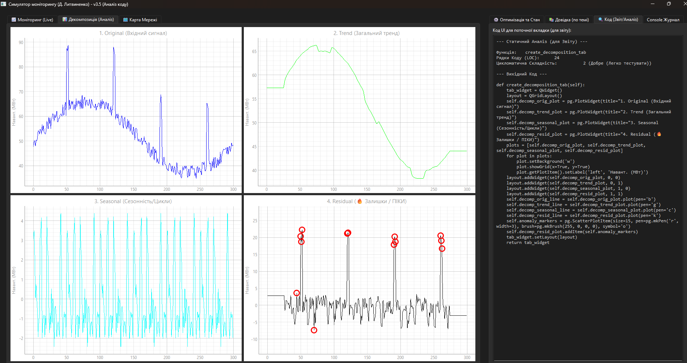
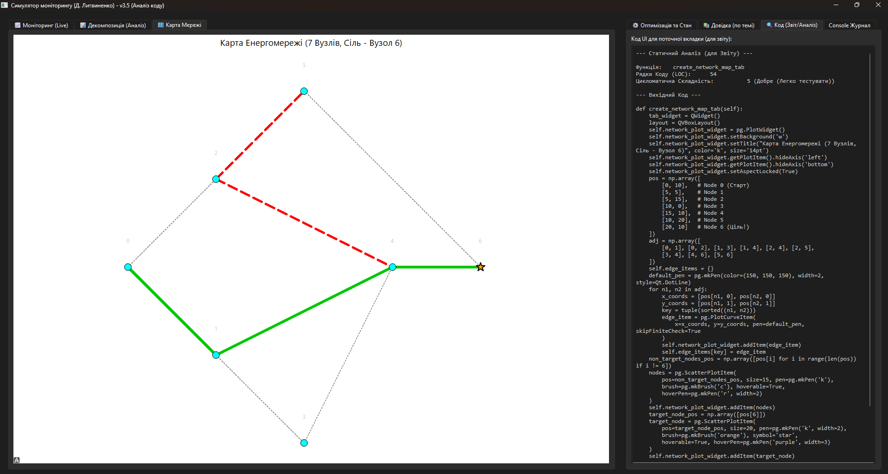

# Cимулятор: "Система моніторингу завантаженості енергосистеми"

**Виконав:** Литвиненко Дмитро, студент групи I-23.

Це десктопний симулятор, розроблений на Python. Він демонструє повний цикл моніторингу та інтелектуального аналізу енергосистеми: від візуалізації "живих" даних до автоматичного пошуку аномалій та симуляції аварій в реальному часі.

## 📸 Демонстрація Роботи

**"Живий" моніторинг (з аварійними піками):**


**Декомпозиція та Детекція Аномалій (ізоляція "піків"):**


**Інтерактивна Карта Мережі (імітація аварії та пошук нового шляху):**


-----

## 👥 Автори

Цей проєкт є результатом спільної роботи:

  * **Литвиненко Дмитро (I-23):** **Розробка та Архітектура**

      * Реалізація повного стеку програми (Backend та Frontend).
      * Написання коду для `PySide6/PyQtGraph` (UI/Візуалізація).
      * Імплементація алгоритмів (`ACO`, `DE`, `Statsmodels`) на Python.
      * Створення інтерактивного симулятора ("живі" дані, клікабельна карта).

  * **Роман Сапсай:** **Концепція та Аналіз**

      * Розробка академічної бази та методології проєкту.
      * Аналіз та вибір оптимальних інтелектуальних методів (обґрунтування `ACO`, `DE` та ін.).
      * Постановка задачі для детекції аномалій та симуляції аварій.

-----

## 🚀 Ключові Можливості

Проєкт демонструє вирішення 9 контрольних питань на практиці:

  * **📈 "Живий" Моніторинг:** Візуалізація поточного навантаження в реальному часі (`PyQtGraph`).
  * **📊 Аналіз (Statsmodels):** Автоматична декомпозиція часового ряду для ізоляції тренду, сезонності та небезпечних "піків" (аномалій). (Відповідь на **№8**)
  * **🤖 Детекція Аномалій (Sklearn + DE):** Використання **Еволюційного Алгоритму (DE)** для автоматичного пошуку гіперпараметрів (`contamination`) та навчання моделі `IsolationForest` для детекції "піків". (Відповідь на **№11, 21**)
  * **🗺️ Інтерактивна Карта (ACO):** Симулятор диспетчера.
      * Дозволяє "ламати" ЛЕП (кліком миші) для імітації аварії.
      * Автоматично запускає **Мурашиний Алгоритм (ACO)** для пошуку нового, оптимального шляху обходу. (Відповідь на **№34, 41**)
  * **🛡️ Звіт (Radon):** Автоматична генерація звіту про якість коду (Цикломатична складність, LOC) для кожної вкладки UI.
  * **🎓 Академічна Довідка:** Вбудовані, персоналізовані відповіді на контрольні питання (№4, 6, 30, 48...) в контексті проєкту.

-----

## 🛠️ Стек Технологій

  * **Python** (3.10, 3.11, 3.12, 3.13+)
  * **GUI:** PySide6 (Qt)
  * **Графіки:** PyQtGraph
  * **Обчислення:** NumPy, Pandas
  * **Оптимізація:** SciPy (для `differential_evolution`)
  * **Аналіз Часу:** Statsmodels (для `seasonal_decompose`)
  * **Машинне Навчання:** Scikit-learn (для `IsolationForest`)
  * **Аналіз Коду:** Radon (для метрик LOC та складності)

-----

## ⚙️ Встановлення та Запуск

Проєкт можна запустити двома способами.

### Спосіб 1: Рекомендований (через .venv)

Цей підхід ізолює проєкт і гарантує, що він не зламає інші ваші програми (і не зламається сам).

1.  **Створіть віртуальне середовище:**

    ```bash
    py -m venv .venv
    ```

2.  **Активуйте його:**

    ```bash
    .\.venv\Scripts\activate
    ```

3.  **Встановіть залежності (тільки для цього проєкту):**

    ```bash
    pip install PySide6 pyqtgraph scipy numpy pandas statsmodels scikit-learn radon
    ```

4.  **Запустіть програму:**

    ```bash
    python main.py
    ```

### Спосіб 2: Глобальний (Не рекомендовано)

Цей спосіб спрацює, якщо у вас глобально встановлені всі бібліотеки.

1.  **Встановіть всі залежності глобально:**

    ```bash
    pip install PySide6 pyqtgraph scipy numpy pandas statsmodels scikit-learn radon
    ```

2.  **Запустіть програму:**

    ```bash
    python main.py
    ```

    *(**Попередження:** Цей метод може викликати конфлікти з іншими проєктами.)*

-----

## 📂 Структура Проєкту

Проєкт розділений на 4 логічні файли:

  * `main.py`: **Точка входу.** Тільки запускає програму.
  * `app_backend.py`: **Бекенд.** Вся логіка (ACO, DE, Statsmodels, Sklearn).
  * `app_ui.py`: **Фронтенд.** Весь код GUI (PySide6) та візуалізації (PyQtGraph).
  * `help_content.py`: **Контент.** Весь статичний HTML-контент для вкладки "Довідка".
